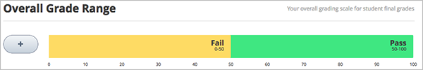

.. _Establish a Grading Policy:

#######################################
Establecer políticas de calificaciones  
######################################

****************
Visión General
****************

El establecimiento de una política de evaluación tiene varios pasos. Usted debe:

#. :ref:`Establecer el rango de calificaciones`
#. :ref:`Configurar el periodo de calificación`
#. :ref:`Configuracion de tipos de tareas`
#. :ref:`Calificación de Subsecciones`
#. :ref:`Vista de calificaciones para los estudiantes`

.. important:: Algunos cambios de políticas de calificaciones, calificación de subcciones o calificaciones de componente depués de iniciado el curso pueden afectar la esperiencia de los estudiantes en el 
	       curso y el analisis de los datos. 

.. _Establecer el rango de calificaciones:

***************************************
Establecer el rango de calificaciones
***************************************

Se debe establecer el rango de las calificaciones para el curso. Por ejemplo, el curso se puede pasar/perder, o pueden tener calificaciones de la A a la F

Para establecer el rango, en el menú "Ajustes", selecciones **Calificaciones**.

El control del rango esta en la parte superior de la pagina en calificaciones.

El ejemplo anterior muestra que usted tiene pasado/fallido dentro del rando de calificaciones, con una puntuación de 50 como punto de corte. Esta es la configuración por defecto utilizado al crear un curso.

Se utiliza el control de rango de calificaciones para cambiar estos ajustes:

* Añadir una nueva calificación en el rango, haga click en el icono ** + **.

   Una nueva calificación  se añade  entre las ya  existentes. Por ejemplo, si agrega una nueva  en la configuración por defecto, el rango seria  para **F** (0 a 50), **B**(50 a 75), y **A** (75 a 100):

  .. image:: ../Images/grade_range_b.png
    :alt: Image of an altered Grade Range control

* Para cambiar el rango de puntuación, mueva el cursor sobre la línea que divide las calificaciones  y luego haga click y arrastre la línea hacia la izquierda o derecha.

   Usted puede ver los números del rango de las calificaciones adyacentes a la línea de cambio.
   Suelte el botón del ratón cuando la línea este donde usted lo desee.

* Para cambiar el nombre de la nota, haga doble click en el nombre actual de la calificación para seleccionarlo, y luego comenzar a escribir el nuevo nombre. Por ejemplo, si el nombre original de la nota
 es "Aprobado", puede hacer doble click en "Aprobado" y luego escribe "Excelente" para reemplazar el nombre.

   No se puede cambiar **F** o **Falla**.

* Para eliminar una nota, mueva el cursor de modo que este queda encima de otra nota.
   Un **enlace **aparece por encima de la calificación. Haga click en el enlace.

   No se puede quitar F o A.

Después de realizar cualquier cambio en el rango de calificaciones, debe hacer click en **Guardar Cambis ** en la parte inferior de la página.

.. _Configurar el periodo de calificación:

======================================
Configurar el periodo de calificación
======================================

Si usted planea para su curso ofrecer certificados, tenga en cuenta que la calificación de los  estudiantes para obtener un certificado mediante la obtención de cualquier calificación sobre F, o fallar.
Esto es independientemente del número de niveles de grado se agrega en el rango de grado.

.. _Set the Grace Period:

*************************************
Establecer periodo de Calificaciones
************************************

Puede establecer un período de gracia para que  extienda las fechas de vencimiento de las tarea.

.. note:: El período de gracia se aplica a todo el curso; no se puede establecer un período de gracia para las asignaciones individuales.

En la página de calificación, en **Reglas y políticas que calificanción**, introduzca un valor en el campo **Período de Gracia**. Introduzca el valor en formato Horas: Minuto.    

.. _Configuracion de tipos de tareas:

*********************************
Configuracion de tipos de tareas
*********************************

Se debe crear el tipo de tarea para el curso y determinar el peso de la calificación para cada tipo de asignación.

Por ejemplo, se debe tener:

* 10 deberes asignados, la nota total es del 50%; 
* Un examen, el  20% de la nota; 
* Un examen final, el 30% de la nota. 

Por defecto cada curso se crea con cuatro tipos de tareas: 

* Deberes
* Lab
* Examen Intermedio
* Examen Final

Se pueden utilizar, modificar o remover cualquier tipo de tareas, y crear uno nuevo si es necesario.

Para crear un nuevo tipo de tarea, en el boton en la pagina de Calificaciones, click en **Nuevo tipo de tarea**, configurar los campos que se describen a continuación. 

==========================
Campos de tipos de tareas
==========================

La configuración de los campos para cada tipo de tarea es la siguiente:
    
* **Nombre:** 
  
  Categoria general de la tarea. Ese nombre será visible para los estudiantes.
 
  .. note:: Todas las tareas de un tipo particular cuentan con el mismo peso de esa categoría. Como resultado,una tarea que contiene 10 problemas vale el mismo porcentaje de la calificación 
             como una tarea que contiene 20 problemas.

* ** Advertencia: **

   Este es el nombre corto que aparece junto a una tarea de los estudiantes **Progreso**.

* ** Pero total de la Calificacón: **

   Las tareas de este tipo en conjunto representan el valor del porcentaje establecido en  ** Peso total de la Calificación**.

   El peso total de todos los tipos de asignación debe ser igual a 100.
   
  
  .. note:: No incluye el signo  (%) en este campo.
  
* **Total numerico:**

El número de tareas de este tipo que va a incluir en su curso.

* ** Número de Droppable **

   El número de tareas de este tipo que  se incluirán en el curso.
   La primera calificación con menor puntaje de la tarea será dada de baja

.. _Calificación de Subsecciones:

******************************
Calificación de Subsecciones
******************************

Después de configurar tipos de asignación, la organización del curso, se establece el tipo de asignación de los incisos que contienen los problemas que han de ser calificados.

Cada subsección que contiene problemas que serán calificados puede incluir un solo tipo de asignación.

.. note:: 
 
 Sólo se pueden establecer tipos de asignación y las fechas de vencimiento en el nivel de subsección. No se puede establecer tipos de asignación o fechas de vencimiento para 
 secciones enteras o por unidades individuales dentro de las subsecciones. Además, puede designar a una subsección como uno, y sólo uno, de los tipos de asignación que ha configurado.
 Se puede solo configurar un tipo de tarea.
  
See :ref:`Desarrollo Subsections del Curso` para obtener instrucciones generales sobre la configuración de una subsección.

See :ref:` Configurar el tipo de tarea y la fecha de vencimiento de la subsección` para obtener instrucciones sobre la designación de una subsección como tarea calificada.

En una subsección calificada, crea problemas de tipo designado para esa subsección. Se pueden mezclar los problemas de diferentes tipos de asignación en el mismo apartado.

Por ejemplo, si desea crear una tarea y un laboratorio para un tema específico, cree dos subsecciones. Establezca una subsección como el tipo Deberes y el otro como 
el tipo de asignación Lab. Ambas subsecciones pueden constar de otros contenidos, así como los deberes o problemas de laboratorio.

.. note:: 
 Se pueden crear problemas en la sección de estudio sin especificar que la subsección es un tipo de asignación. Sin embargo, estos problemas no cuentan para la calificación 
 del estudiante.

See :ref:`Trabajar en Contenidos con problemas` para obtener instrucciones sobre cómo crear problemas.

.. _Vista de calificaciones para los estudiantes:

*********************************************
Vista de calificaciones para los estudiantes
*********************************************

Después de establecer una política de calificaciones, los estudiantes pueden ver tanto en sus puntajes de problemas, el porcentaje completado y las calificaciones 
actuales en la pestaña de **Progreso ** del curso.
  
  .. image:: ../Images/Progress_tab.png
    :alt: Image of the student Progress tab

Cada elemento en el eje X de la tabla es para una subsección calificada. 
Problemas calificados en unidades no se desglosan en la tabla; la puntuación de cada problema en la subsección se suma a la barra vertical.

Subsecciones calificadas se agrupan en la tabla por tipo de asignación en lugar de la lista en orden cronológico. Por ejemplo, todos los ejercicios de tarea se agrupan, 
seguido por los laboratorios, a continuaciónde  los exámenes.

.. note:: La ** x ** para una asignación en la table de progreso indica que la calificación de esa asignación que pueden ser ignoradas. 
          Puede configurar el número de asignaciones que no serán parte del promedio, en : ref: `Configurar tipos de tareas en construcción`.
