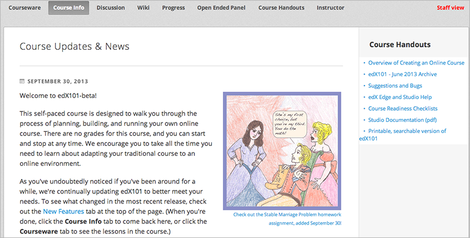

.. _Adding Course Updates and Handouts:

######################################################
Adición de Actualizaciones y Documentos del Curso 
######################################################

Añadir actualizaciones y folletos en ls sessión de estudios.

Los estudiantes pueden ver las actualizaciones y los folletos en la pestaña de **Información del Curso**:

.. _Add a Course Update:

*******************************
Añadir una nueva actualización
******************************

Usted añade actualizaciones para notificar a los estudiantes de los exámenes, cambios en el horario del curso, o cualquier otra cosa de carácter más urgente.

Para agregar un curso de actualización:

#. Desde el menú **Contenido *, seleccione **Actualizaciones**.
#. Haga click **Nueva Actualización**.
#. Introduzca su actualización en el editor de HTML que se abre.

  .. note::  Se debe ingresar a actualizar en HTML. 

4. Click **Guardar**.

.. _Add Course Handouts:

*************************
Añadir folletos al curso
*************************

Puede añadir folletos al curso que son visibles para los estudiantes en la página **Información del Curso**. Para agregar un archivo cargado en los folletos del curso, es necesario su URL.

.. note:: Usted debe :ref:`Añadir de archivos a una Curso` antes de que usted puede añadirlos como
  folletos del  curso.

#. Desde el menú **Contenido **, seleccione **Actualizaciones**.
#. En el panel en  **Folletos del Curso **, haga click en ** Editar **.
#. Ver :ref:`Añadir un Enlace en un Componente HTML`para más información.
#. Haga click en **Guardar**.

