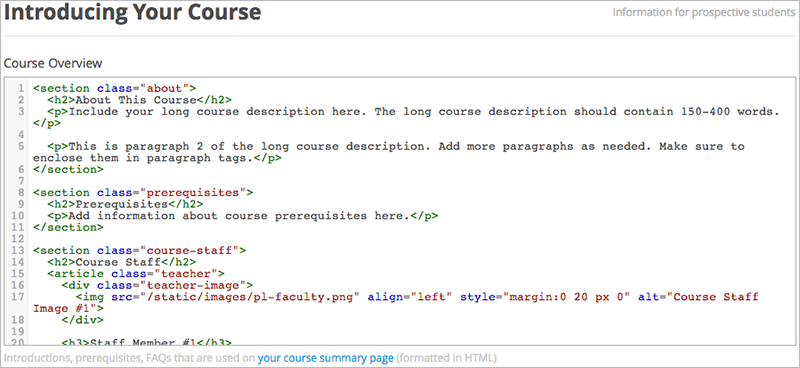

.. _Configuración de la vista del estudiante:

######################################################
Configuración de la vista del estudiante
######################################################

***************
Vista General
***************

En este capítulo se describe la forma de configurar el curso que se mostrará en la página de resumen del curso y en ** Cursos actuales del estudiante **.
La información que se configura para su curso es importante para los estudiantes actuales y futuros.

Ver:

* :ref:`Resumen del curso`
* :ref:`Panel de Control del Estudiante`
* :ref:`Establecer fechas importantes para el Curso`
* :ref:`Fecha para iniciar el Curso`
* :ref:`Ajustar la fecha de inicio del anuncio`
* :ref:`Fecha de Fin de Curso`
* :ref:`Describir Curso`
* :ref:`Añadir una imagen al Curso`
* :ref:`Añadir videos al curso`
* :ref:`Establecer Requisitos del Curso`
* :ref:`Modelo Para La Visión general del curso`

.. _Edge: http://edge.edx.org
.. _edX.org: http://edx.org

.. _Resumen del curso:

*****************************
Resumen del Curso
*****************************

La imagen que se muestra a continución es un ejemplo de una página de resumen de cursoe. Los estudiantes pueden ver el resumen del curso antes de que ellos se
inscriban en el curso, y puedan decidir basandose en el contenido de la página. Configurar el contenido de la página de estudio, como se describe en este capítulo:

.. _Panel de Control del Estudiante:

***********************************
Panel de Control del Estudiante
***********************************

Si un estudiante inscrito en el curso, el curso se enumera a continuación, en el panel de control en **Cursos Actuales **, 
la imagen del curso. Desde el panel de control, un estudiante puede abrir un curso que ha comenzado. Si el curso no se ha iniciado, el alumno puede ver la fecha de inicio, como se explica en este capítulo.

.. _Establecer fechas importantes para el Curso:

********************************************
Establecer fechas importantes para el Curso
********************************************

Se debe ajustar las fechas y tiempos para las inscripciones y para el curso.

Es estudios, desde el menu  **Ajustes**, seleccione  **Horarios y Detalles**.  

Sigue el texto de la pantalla para ingresar curso y horario de matriculas.

.. note:: 

 Los campos de hora de esta página, y las veces que los estudiantes ven, usan UTC
  (Tiempo Universal Coordinado)

.. _Fecha para iniciar el Curso:

***********************************
Fecha para iniciar el Curso
***********************************

.. note:: La fecha predeterminada de inicio del curso  se establece a futuro, a ** 01/01/2030 **. Esto es para asegurar que el curso no se inicia antes de que se requiere. 
Se debe cambiar la fecha de inicio del curso a la fecha en que desea que los estudiantes comiencen a utilizar el curso.

Los estudiantes ven la fecha de inicio del curso y el tiempo en sus paneles de control **Cursos actuales** y 
en el curso Sobre la página (a veces también llamada la página de resumen del curso). Los estudiantes pueden ver algunas partes del curso antes de la fecha de inicio del curso. 
Por ejemplo, los estudiantes pueden ver  **Información del Curso** y a todo el curso como  los temas de discusión en cuanto se matriculen al curso. Para obtener 
más información acerca de los temas de discusión en todo el curso, ver: ref: `Crear Temas de Discución`.

El siguiente ejemplo muestra la fecha de inicio del curso y la hora en la página de resumen del curso:

.. note:: 
 Para los cursos en edX.org_, deberá comunicar la fecha y la hora de inicio del curso a su director del programa edx para asegurar la fecha es exacta en el curso.

En el panel de control, los estudiantes ven las fechas de inicio y los tiempos para cada uno de sus cursos, como en los siguientes ejemplos.

.. note:: Si no se especifica una hora de inicio del curso, los estudiantes verán por defecto la hora, 00:00(UTC).

.. _Ajustar la fecha de inicio del anuncio:

***************************************
Ajustar la fecha de inicio del anuncio
***************************************

Se puede establecer una fecha de inicio del anuncio para el curso que que sea diferente que la fecha de inicio del curso que se establecio en la página de **Horarios y detalles** 
Es posible que desee hacer esto si existe incertidumbre sobre la fecha de inicio exacta. Por ejemplo, usted podría anunciar la fecha de inicio como **Primavera de 2014**.

Establecer la fecha de inicio del anuncio:

#. Desde el menú  **Ajustes**, selecciones  **Ajustes de Anuncio**.
#. Buscar  **Fecha de inicio del anuncio del curso** . Por defecto el valor es **null** 
#. Introduzca el valor que desea visualizar como la fecha de inicio. Puede utilizar cualquier cadena, encerrado entre comillas dobles. Si formatea la 
   cadena como una fecha (por ejemplo, como 02/01/2014), el valor es interpretada y presentada a los estudiantes como una fecha.

  .. image:: ../Images/advertised_start.png
   :alt: Image of the advertised start date policy key with a value of "anytime, self-paced"

4. Click **Guardar Cambios** en la parte inferior de la pagina.

La fecha de inicio se muestra en el panel de control este ahora es el valor del  ** Anuncio de la Fecha de Inicio del Curso** :

     advertised start date circled.

Si no se realiza ningun cambio por defecto la fecha de inico del curso será (01/01/2030), y el valor de **Anuncio de la Fecha de Inicio del Curso**
es  ``null``, entonces los estudiantes en el panel de control no podrán ver la fecha de inicio del cursoe. Los estudiantes solo podrán ver que el curso aun no espieza.

.. _Fecha de Fin de Curso:

***********************************
Fecha de Fin de Curso
***********************************

La fecha de fin de Curso es la fecha después de la cual los estudiantes no pueden obtener créditos para los certificados.Los estudiantes que tienen certificados obtenidos 
pueden verlos después de la fecha de finalización del curso..

.. important::
 Si no se establece la fecha de finalización del curso, los estudiantes no podrán acceder a los certificados obtenidos.

.. note:: 
 Para los cursos en edX.org_, deben comunicarse la fecha de finalización del curso para el administrador del programa edXr, para confirmar que la fecha sea exacta en la página de resumen del curso.

Despues de que las calificaciones y certificados son finalizados, los estudiantes ven la fecha de finalización en su paneles de control **Cursos Actuales**, como se muestra en el siguiente ejemplo.

* Si las calificaciones y certificados no son aun finalizados, lis estudiantes pueden ver la fecha de finalización del curso y un mensaje:

  .. image:: ../Images/dashboard-wrapping-course.png
   :alt: Image of a course on the student dashboard that has ended, but not
     been graded

* Cuando las calificaciones y certificados son finalizados, los estudiantes quienes no han obtenido un certificado pueden ver sus puntajes y los requeridos para obtener un certificado:
  
  .. image:: ../Images/dashboard-no-cert-course.png
   :alt: Image of a course on the student dashboard that has ended, but not
     been graded

* ]Los estudiantes quienes tengan un puntaje igual o mayor al puntaje requerido pueden hacer click en **Descargar Certificado** para obtener sus certificados en PDFs:

  .. image:: ../Images/dashboard-completed-course.png
   :alt: Image of a course on the student dashboard that has ended, but not
     been graded

.. _Describir Curso:

************************
Describir Curso
************************

En Edge_, los estudiantes a los que invite explícitamente ver la descripción de su curso en la página de resumen del curso.

Por ejemplo, la descripción del curso esta encerrado en la siguiente página de resumen.

.. note:: For courses on edX.org_, you must communicate the course description
 to your edX Program Manager, to ensure the content is accurate on the course
 summary page.

#. From the **Settings** menu, select **Schedule & Details**.
#. Scroll down to the **Introducing Your Course** section, then locate the
   **Course Overview** field.

3. Sobreescribir el contenico según sea  necesario para el curso, 
   siguiendo las instrucciones en el texto modelo. No edite etiquetas HTML. Para una plantilla que incluye marcadores de posición, ver: ref: `Una plantilla para Curso Overview`

   .. note:: No hay un boton para grabar. Los cambios son guardados automaticamente.
 
4. Click **página resumen del cursoe** en el texto debajo del campo probar cómo aparecerá la descripción para los estudiante.

.. _Añadir una imagen al Curso:

***************************
Añadir una imagen al Curso
***************************

La imagen del curso que se quiere añadir en el Estudio aparece en el panel del control. 

In Edge_,la imagen tambien aparece en la página de resumen.

En el siguiente ejemplo, la imagen del curso que se añadió en Estudio es un círculo en el panel de control del estudiante:

En edX.org_, la imagen del curso se añade en Estudio no aparece en la página de resumen automaicamente, Se debe trabajar directamente con el Administrador del programa edX
para configurar la página de resumen del curso.

La imagen del curso debería ser mínimo de 600 pixeles de ancho por 240 pixels alto, y en formato .JPG o .PNG.

#. Desde el menú **Ajustes**, seleccionar **Horarios y detalles**.
#. Vaya a la sección de **Imagen Curso**.
#. Para seleccionar la imagen desde la computador, click en **Cargar imagen del curso**, a continuación, siga las instrucciones para encontrar y cargar la imagen.
#. Ver su panel de control para probar cómo aparecerá la imagen para estudiantes.

.. _Añadir videos al curso:

*********************************
Añadir videos al curso
*********************************

En Edge_, el video introductorio del curso aparecen en la página de resumnen que los estudiantes ven.

.. note:: En edX.org_, se trabaja directamente con el administrador del programa para configurar el video del curso en la página de resumen.

En el siguiente ejemplo, el video del curso esta redondeado en la página de resumen

El vídeo curso debe excitar y seducir a los potenciales estudiantes para inscribirse, y revelar algo de la personalidad de los instructores de traer al curso.

El video debería responder las preguntas claves:

* Quienes enseñan el curso?
* ¿Qué universidades están afiliados con el curso? 
* ¿Qué temas y conceptos son cubiertos por este curso?
* ¿Por qué un estudiante deberia inscribirse en el curso?

El video debería comunicar el mensaje de una manera concisa y tener un tiempo de ejecución de menos de 2 minutos.

Se debe asegurar que el video de introducción al curso sea similoar al siguientee :ref:`Especificaciones de compresión` y :ref:`Formatos de Video` directrices como videos.

Añadir un video de introducción del curso:

#. Suba el video del curso a YouTube. Anote el código que aparece entre **watch?v =** y **&características ** en la URL. Este código aparece en el cuadro verde de abajo.

  .. image:: ../Images/image127.png
    :alt: Image of a sample course video
    
2. Desde el menú  **Ajustes**, seleccione  **Horarios y Detalles**.
#. Vaya a la sección de** Curso Introducción video **.
#. En el campo debajo del cuadro de vídeo, introduzca el ID de vídeo de YouTube (el código que copió en el paso 1). Cuando se agrega el código, el video se carga 
   automáticamente en el cuadro de video. Estos cambios son guardados automáticamente.
#. Ver la página de resumen del curso para probar cómo aparecerá el vídeo a los estudiantes.

.. _Establecer Requisitos del Curso:

********************************
Establecer Requisitos del Curso
********************************

El esfuerzo estimado por Semana aparece en la parte inferior de la página resumen del curso.

#. Desde el menú  **Ajustes**, seleccione  **Horarios y Detalless**.
#. Vaya a la sección  **Requisitos**.
#. En el campo **Horas de Esfuerzo por Semana **, introduzca el número de horas que espera que los estudiantes trabajen en este curso cada semana.
#. Rebisar la página de resumen del curso para comprobar como los requisitos aparecen para los estudiantes.

.. _Modelo Para La Visión general del curso:

************************************************
Modelo Para La Visión general del curso
************************************************

  

Reemplace los placeholders en la plantilla siguiente con su información.

.. code-block:: html

  <section class="about">
    <h2>Acerca de este curso</h2>
    
Incluya la descripción larga aquíe. El largo de la descripción del curso
      debería contener 150-400 palabras.

    
Este es el párrafo 2 de la descripción del curso largo. Añadir más párrafos, 
      según sea necesario. Asegúrese de incluir en las etiquetas del párrafo.

  <section>
  <section class="prerequisites">
    <h2>Prerequisitos</h2>
    
Añadir información acerca de las clases de prerequisitos aquí.

  </section>
  <section class="course-staff">
    <h2>Staff del curso</h2>
    <article class="teacher">
      

        <!-- Remplace el enlace con el enlace de su imagen. -->
        
      

      <h3>Miembros del Staff</h3>
      
Bibliografía del instructor /miembros del staff

    </article>
  <article class="teacher">
      

        
      

      <h3>Nombre de los mienbros del Staff</h3>
      
Bibliografía del instructor/miembros del staff

    </article>
  </section>
  <section class="faq">
    <section class="responses">
      <h2>Preguntas Frecuentes</h2>
      <article class="response">
        <h3>¿Necesito comprar un libro?</h3>
        
No, una versión gratuita en línea de Química: Principios, Patrones, y Aplicaciones, Primera edición de Bruce Averill y Patricia Eldredge 
          estará disponible, aunque usted puede comprar una versión impresa (publicado por Flatworld Conocimiento) si lo desea..

      </article>
      <article class="response">
        <h3>¿Pregunta 2?</h3>
        
Respuesta 2.

      </article>
    </section>
  </section>

  <!--Parrafo: 
EL CONTENIDO VA AQUÍ
 -->
  <!--Salto de Línea:   -->
  <!--Hipervinculo: <a href="URL">LINK TEXT</a> -->
  <!--Hipervinvulo de Email: <a href="mailto:EMAIL@ADDRESS.COM">LINK TEXT</a> -->
  <!--Texto en Negrita: <b>TEXT</b> -->
  <!--Texto en Italic: <i>TEXT</i> -->
