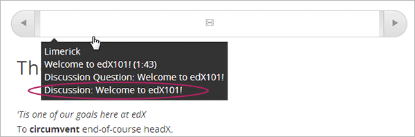
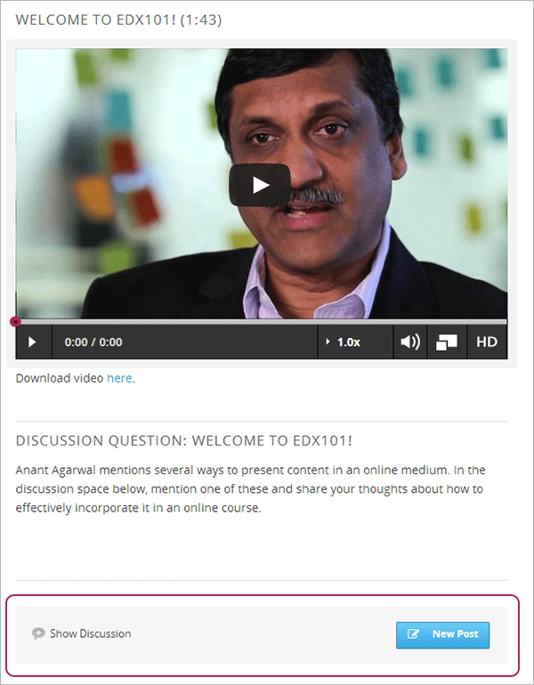
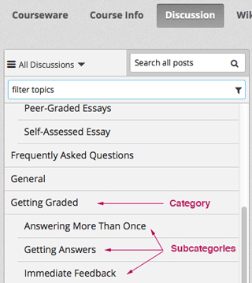

.. _Trabajando con Componetes de Discusión:

#######################################
Trabajando con Componetes de Discusión
#######################################

*******************
Vista General
*******************

Se puede añadir un componente de discusión para una unidad, plantear una pregunta relacionada con la Unidad y dar a los estudiantes la posibilidad de responder e interactuar.

Revisar los siguientes temas:

* :ref:`Crear un componente de discusión`
* :ref:`Vista de la discusión para Estudiantes`

Antes de añadir un componente de discusión, por lo general es una buena idea añadir un componente HTML para la introducción del tema a tratar. 
El propio componente de discusión no contiene ningún texto y puede ser fácil para los estudiantes pasarlo  por alto.

Ver también los siguientes capítulos:

* :ref:`Discusiones`
* :ref:`Guía para moderadores de discusión`

.. _Crear un componente de discusión:

*********************************
Crear un componente de discusión 
*********************************

#. Bajo **Añadir nuevo componente**, click **Discusión**.

#. En el componente de Discusiones que aparece, click **Editar**.
  
   .. image:: ../Images/Disc_Create_Edit.png
    :alt: Image of the discussion component with the Edit button circled

#. Cuando el editor del componente de discusión se abre, seguir las directrices en el editor para rellenar en la  **Categoría**, la opción  **Mostrar nombre** y el campo **Subcategoría**. 
   
   .. image:: ../Images/DiscussionComponentEditor.png
    :alt: Image of the discussion component editor with a category of "Getting Graded" and a subcategory of "Answering More Than Once"

   El valor del campo identificador de la discusión **Mostrar Nombre** en el contenido del curso. Los valores de **Categoría** y **Subcategoría** son campos que aparecerán en el dlistado de
   los temas de discusión en la página **Discusiones**. Para identificar a la discusión en el curso, cada par de ** Categoría ** / **Subcategoría** que se proporcionen debe ser único.

   .. image:: ../Images/Discussion_category_subcategory.png
    :alt: The list of discussions with the "Answering More Than Once" topic indented under "Getting Graded"
  
#. Click **Guardar**.

.. warning:: 
  Siempre debe utilizar estos pasos para crear un componente de discusión. Si se crea un componente de discusión mediante el botón **Duplicar** en estudio, ambos componentes de discusión 
  contendrán las mismas conversaciones, incluso si los usuarios publican en diferentes discusiones.

Las *Categorías* de discusión son inmediatamente visibles en **Discusión** en el curso al crearlas, aunque la unidad que contiene la discusión no se publica. Sin embargo, 
un componente de Discusión individual no es visible hasta que la unidad se publica y las fechas de lanzamiento de la sección y subsección hayan pasado. Para más información 
ver: ref: `Control de visibilidad de contenido`.

Adicionalmente, no se pueden ver los mensajes, responder o comentar en un componente de  discusión cuando se trabaja en Estudio.
Para ver las discusiones, ir a la unidad que contiene el componente de debate en Studio y, a continuación, haga click **Vista Previa** o
**Ver en vivo** debajo **Configuración de unidad**.

.. _Vista de la discusión para Estudiantes:

***************************************
Vista de la discusión para Estudiantes
***************************************

Para los estudiantes, el nombre de visualización para el componente discusión aparece en la
cinta de curso en la parte superior de la página:

     showing a discussion component

El espacio de debate aparece debajo de otros componentes de la unidad. No tiene una etiqueta en el cuerpo de la unidad. En cambio, los estudiantes ven "Mostrar discusión" o "Ocultar discusión" 
a la izquierda, y un botón azul ** Nuevo Post ** a la derecha.

En el siguiente ejemplo, el componente de discusion sigue componentes de vídeo y HTML:

En la pestaña  **Discusiones** en la parte superior de la página, los estudiantes pueden buscar la categoría y subcategoría de la discusión en el  panel izquierdo.

