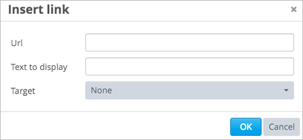
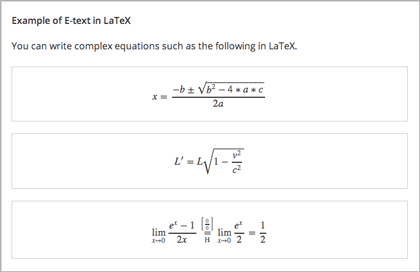

.. _Trabajar con Componentes HTML:

#############################
Trabajar con Componentes HTML
#############################

***********************************
Vision General de Componentes HTML
***********************************

HTML, o HyperText Markup Language, es el lenguaje de marcado estándar utilizado para crear páginas web. Navegadores Web presentan código HTML en un formato más legible.

Cuando los estudiantes ven el texto y las imágenes en el curso, ellos estan viendo el código HTML que esta dado formato y presentado en los navegadores. Para obtener más 
información acerca de HTML, consulte `Wikipedia <http://en.wikipedia.org/wiki/HTML>` _.

Los Componentes HTML son los contenidos básicos utilizados para la construcción del curso . Utiliza componentes HTML para agregar y dar formato al texto, enlaces, imágenes y más. 
Usted puede optar por crear componentes HTML directamente en código HTML, o mediante un editor visual que esconde los detalles del código HTML, como se describe a continuación.

Para más información, ver los siguientes temas:

* :ref:`Opciones para Editar compoinentes HTML`
* :ref:`Editor Visual`
* :ref:`Editor Raw HTML`
* :ref:`Plantillas de Componentes HTML`
* :ref:`Crear un componente HTML`
* :ref:`Añadir un enlace en un componente HTML`
* :ref:`Añadir una imagen en un componente HTML`
* :ref:`Importación código LaTexe`

.. note:: 
 Revisar :ref:`Desarrollo del Indice del Curso` y :ref:`Las mejores práscticas para el formato HTML` antes de empezaar a trabajar con componentes HTML.

Para añadir un hangout instantáneo para un componente HTML, ver :ref:`Hangout Instantáneo de Google`.

.. _Opciones para Editar compoinentes HTML:

********************************************
Opciones para Editar compoinentes HTML
********************************************

Para trabajar con HTML existen dos formas:

* :ref:`Editor Visual`
  
  Con el editor Visual se puede crear, editar, y dar formato al contenido en una palabra como interfaz de procesamiento, sin usar directamente código HTML.
  Con el editor Visual, se puede dar formato al contenido de manera mas sencilla, y añadir links e imagenes. El editor Visual proporciona acceso al código HTML
  para hacer cambios pequeños para formatear, si se requiere. Sin embargo, la vista HTML en el editor visual no proporciona un  control detallado como se puede 
  obtener con el editor de HTML puro, y no admite el formato o las secuencias de comandos personalizados.

* :ref:`Editor Raw HTML`

  Con el editor Raw HTML, se puede trabajar directamente con código HTML. Si se necesita usar  formato o las secuencias de comandos personalizados,
  se debe utilizar el editor Raw HTML.

Ajustar el editor para un componente HTML
******************************************

Ajustar el editor para un componente HTML en la pestaña **Ajustes**:

Seleccionar **Visual** o **Raw**. Cuando cambia el editor, se debe hacer click en **Guarda** y abrir nuevamente el componente para empezar a usar el nuevo editor.

.. warning:: 
 Si se trabaja con contenido en el editor Raw HTML, luego al cambar al editor Visual, se puede perder el HTML personalizado que creó. Por lo tanto, se recomienda 
 que se comience usando el editor de Visual, a continuación, abrir el editor HTML puro cuando se necesita para crear HTML personalizado.

.. _Editor Visual:

*****************************************
Editor Visual
*****************************************

El editor visual proporciona un "Lo que se ve es lo que se obtiene" (WYSIWYG) interfaz que le permite formatear el texto haciendo click en los botones de formato en 
la parte superior del editor.

La siguiente imagen muestra diferentes opciones para las ediciones y es seguida por descripciones.

.. image:: ../Images/HTML_VisualView_Toolbar.png
  :alt: Image of the HTML editor, with call-outs for formatting buttons

#. Escoja un estilo para el formato para el párrafo seleccionado, así como el Título 1, Título 2 o párrafo.
#. Elegir una familia de fuentes para el texto seleccionado, como Arial, Courier New o Times New Roman.
#. Seleccione el formato de la letra en negrita.
#. Seleccione el formato de la letra en italics.
#. Subrayar el texto seleccionado.
#. Aplicar un color al texto seleccionado.
#. Formato de texto en código seleccionado.
#. Crear lista de viñetas.
#. Crear una lista de números.
#. Disminución y aumento de la sangría del párrafo seleccionado.
#. Dar formato a un párrafo seleccionado como a blockquote.
#. Crear un enlace desde un texto seleccionado. ver :ref:`Añadir un link en un componente HTML`.
#. Eliminar enlace actual.
#. Insertar imagenes al curso. Ver :ref:`Añadir una imagen para un componente HTML`.
#. El trabajo con el código fuente HTML, se describe a continuación.

.. _Trabajar con código HTML:

Trabajar con código HTML en el Editor Visual
*********************************************

Para trabajar con código fuente para el contenido se debe crear en el editor visual, click **HTML** en la barra de herramientas del editor. 
El código fuente se abre en el editor:

.. image:: ../Images/HTML_source_code.png
 :alt: Image of the HTML source code editor

Para editar código HTML es necesario. 

No se debe añadir estilos o scripts personalizados en la vista de código HTML en el editor visual. Utilice el editor de HTML puro.

Haga clic en **Aceptar ** para cerrar el editor de código fuente y aplicar los cambios en el editor de Visual. El editor de Visual luego intenta garantizar 
que el código HTML sea válido; por ejemplo, si no se cierra una etiqueta de párrafo, el editor lo cerrará por Ud.

.. warning:: 
 Al hacer click en **Aceptar** en el editor de código fuente no guarda los cambios en el componente HTML. Volverá al editor de componentes, 
 donde se aplican los cambios. A continuación, debe también hacer click en **Guardar** para grabar los cambios y cerrar el componente. 
 Click en  **Cancelar**, para quelos cambios realizados en el código fuente HTML se pierden.

.. _Editor Raw HTML:

*****************************
Editor Raw HTML
*****************************

Cuando se selecciona el editor Raw para el componente HTML, edita el contenido en un editor de texto:

.. image:: ../Images/raw_html_editor.png
 :alt: The Raw HTML editor

Debe introducir HTML válido. El editor Raw HTML puro no valida el código HTML.
Por lo tanto se debe comprobar el contenido HTML en tu curso.

.. _Plantillas de Componentes HTML:

*******************************
Plantillas de Componentes HTML
*******************************

Cuando se crea un nuevo componente HTML, se puede seleccionar desde una lista de platillas:

Las platillas Raw HTML esta configurada para usar en el editor Raw HTML. Todas las otras plantillas usa el editor Visual.

Para ningun componente HTML, se puede cambiar el editor, independientemente de la plantilla usada para crear el componente. Ver `Ajuste el Editor para un componente HTMLt`_.

.. _Crear un componente HTML:

*****************************
Crear un componente HTML
*****************************

Para crear un componente HTML:

1. Debajo de **Añadir nuevo componente**, click **HTML**.

  .. image:: ../Images/NewComponent_HTML.png
   :alt: Image of adding a new HTML component

2. Seleccionar la plantilla. 

   El resto de estas instrucciones se asume que se  ha seleccionado **Texto**, que crea un componente vacío con el editor Visual seleccionado.

   Un componente vacío aparece en la parte inferior de la unidad.

  .. image:: ../Images/HTMLComponent_Edit.png
   :alt: Image of an empty HTML component

3. En el componente, click **Editar**.

   El componente HTML se abre en el editor Visual.

  .. image:: ../Images/HTMLEditor_empty.png
   :alt: Image of the HTML component editor

4. Ingrese y formatee el contenido. Puede :ref:`Trabajar con código HTML` si es necesario.

5. Ingrese el nombre (el nombre que se requiera para que el estudiante lo vea). Para hacer esto,
   click **Ajustes** en la esquina superior derecha de el editor de componente, y luego ingrese el texto en el campo **Nombre**.

   Regrese al editor de texto,  click **Editor** en la esquina superior derecha.

6. Click **Grabar** para guardar los componentes HTML.

Cuando se usa un editor Visual, se puede también:

* :ref:`Añadir un enlace en un componente HTML`
* :ref:`Añadir una imagen en un componente HTML`
* :ref:`Importación código LaTexe`

.. _Añadir un enlace en un componente HTML:

**************************************
Añadir un enlace en un componente HTML
**************************************

Cuando se usa el editor Visual, para añadir un link en un website, en una unidad del curso, o en un archivo en un componente HTML, se debe trabajar con el cuadro de dialogo **Insertar enlace**.

Puede:

* :ref:`Añadir enlace a un Website`
* :ref:`Añadir enlace a la unidad del curso`
* :ref:`Añadir enlace a un archivo`

.. _Añadir enlace a un Website:

Añadir enlace a un Website
***********************************

Añadir enlace a un Website:

#. Seleccione el texto que desea convertir en enlace.

#. Haga click en el icono de enlace en la barra de herramientas.

#. En el cuadro de dialogo **Introducir enlace**, ingrese al URL de el website que desea en el campo **URL**.

   .. image:: ../Images/HTML_Insert-EditLink_Website.png
    :alt: Image of the Insert link dialog box

#. Si se desea que el enlace se abra en una nueva ventana, click en la lista desplegable al lado del campo **Target**, y luego seleccionar **Nueva ventana**. Si no, se puede dejar con el valor por defecto.

#. Click **Aceptar**.

#. Guardar el componente HTML y probar el enlace.

.. _Añadir enlace a la unidad del curso:

Añadir enlace a la unidad del curso
************************************

Se puede añadir un enlace en la unidad del curso en un componente HTML.

#. Obtener el identificador que se está enlazando. Para ello, se debe abrir la página en la unidad de estudio, y copiar el ID de la unidad desde el campo **Identificador de Unidad** 
   bajo  **Ubicación de la unidad** en el panel derecho.
   
   .. image:: ../Images/UnitIdentifier.png
    :alt: Image of the unit page with the unit identifier circled

#. Abrir el componente HTML donde se quiere añadir el enlace.

#. Seleccione el texto que desea convertir en enlace.

#. Haga click en el icono de enlace en la barra de herramientas.

#. En el cuadro de dialogo **Introducir enlace**, ingrese al URL de el website que desea en el campo **URL**.

   ``/jump_to_id/<unit identifier>``

   Asegúrese de reemplazar <identificador de la unidad> (incluidos los soportes) con el identificador de la unidad que copió en el paso 2 y asegúrese de incluir ambas barras inclinadas (/).

   .. image:: ../Images/HTML_Insert-EditLink_CourseUnit.png
    :alt: Image of the Insert link dialog box with a link to a unit identifier

#. Si se desea que el enlace se abra en una nueva ventana, click en la lista desplegable al lado del campo **Target**, y luego seleccionar **Nueva ventana**. Si no, se puede dejar con el valor por defecto.

#. Click **Insertar**.

#. Guardar el componente HTML y probar el enlace.

.. _Añadir enlace a un archivo:

Añadir enlace a un archivo
***********************************

Se puede añadir un enlace en un componente HTML a cualquier archivo cargado en el curso. Para más información acerca de cargar archivos, ver :ref:`Añadir archivos al curso`.

#. En la página de **Archivos & Cargas**, copiar el **URL Embebido** del archivo.

  .. image:: ../Images/HTML_Link_File.png
   :alt: Image of Files and Uploads page with the URL field circled 
  
  .. note:: 
   Se debe usar el enlace **URL Embebido** del archivo, no el **URL Externo**.

2. Seleccione el texto que desea convertir en enlace.

#. Haga click en el icono de enlace en la barra de herramientas.

#. En el cuadro de dialogo **Introducir enlace**, ingrese al URL de el website que desea en el campo **URL**.

   ``/static/FileName.type``

   Asegúrese de incluir las dos barras inclinadas.

   .. image:: ../Images/HTML_Insert-EditLink_File.png
    :alt: Image of the Insert link dialog box with a link to a file

#. Si se desea que el enlace se abra en una nueva ventana, click en la lista desplegable al lado del campo **Target**, y luego seleccionar **Nueva ventana**. Si no, se puede dejar con el valor por defecto.

#. Click **Insertar**.

#. Guardar el componente HTML y probar el enlace.

.. _Añadir una imagen en un componente HTML:

****************************************
Añadir una imagen en un componente HTML
****************************************

Cuando se usa el editor Visual, se puede añadir cualquier imagen que se haya cargado en el curso a partir de un componente HTML. Para más información acerca de 
cargar imagenes, ver :ref:`Añadir archivos al curso`.

.. note:: 
 Revisar: ref: `Las mejores prácticas para describir Images` antes de agregar imágenes para componentes HTML.

Para añadir una imagen, se necesario el URL de la imagen cargada para el curso. Se debe crear un enlace para la imagen en el componente HTML.

#. En la página  **Archivos & Cargas**, copiar el **URL Embebido** de la imagen que se desea.

  .. image:: ../Images/image_link.png
   :alt: Image of the Files & Upload page with the Embed URL for the image
       circled

  .. note:: 
   Se debe usar el enlace **URL Embebido** del archivo, no el **URL Externo**.

2. Haga click en el icono de enlace en la barra de herramientas.

#. En el cuadro de dialogo **Introducir enlace**,escriba lo siguiente en el campo **Fuente**.

   ``/static/FileName.type``

   Asegúrese de incluir las dos barras inclinadas.

   .. image:: ../Images/HTML_Insert-Edit_Image.png
    :alt: Image of the Insert image dialog box with a reference to a file

4. Introduzca el texto alternativo en el campo **Descripción de la image**. Este texto se convierte en el valor del 
   atributo `` alt`` en HTML y esto es necesario para que el curso sea totalmente accesible. Para mayor información ver: ref: `Las mejores prácticas para describir Images`.

#. Según sea necesario, personalizar las dimensiones de imagen. Mantener  **Restringir proporciones** observadondo  hasta comprobar que la imagen mantiene las mismas proporciones de anchura y altura.

#. Para cambiar el espaciado y el borde de la imagen, haga click en la pestaña "Avanzado". 

   .. image:: ../Images/HTML_Insert-Edit_Image_Advanced.png
    :alt: Image of the Insert image dialog box Advanced tab

#. Ingrese el **Espacio Vertical**, **Espacio Horizontal**, y **Borde** como necesita.
   Los valores son ingresados automaticamente en campo **Estilo**.

#. Click **Aceptar** para insertar la imagen en el componente HTML.

#. Guarde el componente HTML y compruebe la imagen.

.. _Importación código LaTexe:

*************************************************
Importación código LaTexe en un componente HTML
*************************************************

Se puede importar código LaTeX ingresando a un componente HTML. Esto se puede hacer, por
ejemplo, si se quiere crear "hermosas matemáticas" como la siguiente.

.. warning:: 
 El procesador LaTeX que Estudio usa para convertir código LATex a XML es una herramienta de otro empresa. 
 Se recomienda que se utilice esta función con precaución. Si se hace uso de esto, asegúrese de trabajar con su Administrador de programasr.

Esta función no está activada por defecto. Para activarlo, se tienen que cambiar las configuraciones avanzadas del curso.

Para crear un componente HTML que contenga código LaTeX:

#. Activar el policy key del curso.

   #. En Estudio, click **Ajustes**, y luego click **Configuración Avanzadas**.
   #. En habilitar el campo para policy key **Activar compilador LaTeX**, cambiar  **false** a **true**.
   #. En la parte inferior de la página, click **Guardar Cambios**.

#. En la unidad en la que desee crear el componente, haga click en "html" en "Añadir Nuevo componente", y
   a continuación, haga click en "E-text Written in LaTeX". El nuevo componente será añadido a la unidad

#. Click **Editar** para abrir el nuevo componente. El editor de componentes se abrirá.

  .. image:: ../Images/latex_component.png
   :alt: Image of the HTML component editor with the LaTeX compiler.

4. En el editor de componentes, click **Launch Latex Source Compiler**. El editor LaTeX se abrirá.

   .. image:: ../Images/HTML_LaTeXEditor.png
    :alt: Image of the HTML component editor with the LaTeX compiler

#. Escribir código LaTeX, según sea necesario. También puede ser cargado desde  un archivo LaTeX en el editor de su ordenador haciendo click en **Cargar** en la esquina inferior derecha.

#. Cuando se ha escrito o cargado código LaTex es necesario, click en **Guardar & Compilar edX XML** en la esquina inferior izquierda.

   El editor de componente se cierra.  Se puede ver la forma en que el contenido LaTex parece.

   .. image:: ../Images/HTML_LaTeX_CompEditor.png
    :alt: Image of the LaTeX component

#. En la página de la unidad, haga click en **Vista previa** para verificar que el contenido tenga el aspecto que se requiere en el LMS.

   Si ve errores, volver a la página de la unidad. Haga click en **Editar** para abrir el componente nuevamente y, a continuación,
   click en **Iniciar compilador Látex** en la esquina inferior izquierda del editor de componentes para editar el código LaTeX.

