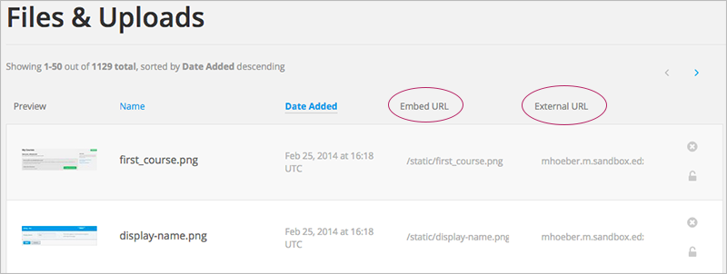
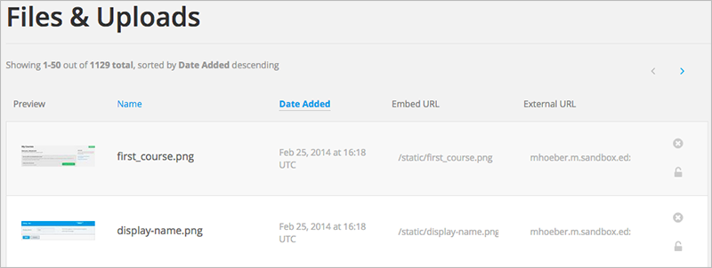

.. _Add Files to a Course:

###########################
Añadir archivos al curso
###########################

*******************
Visión General
*******************

Se debe usar imagene, archivos  u otros documentos como sílabos para el contenido del curso.

* :ref:`Añadir archivo`
* :ref:`URLs de archivos`
* :ref:`Ordenar archivos`
* :ref:`Buscar archivos`
* :ref:`Bloquear archivo`
* :ref:`Borrar archivo`

.. _Añadir archivo:

*******************
Añadir archivo
*******************
 
Se puede añadir archivos, que se deseen dar accesos a los estudiantes del curso.Despues de añadir un archivo se debe enlazar con él desde un componente, una actualización del curso,
 o en los folletos del curso. Un archivo es visible sólo para los estudiantes si se crea un enlace a ella.

Ya que el nombre llega a ser parte de la URL, los estudiantes pueden ver el nombre del archivo cuando lo abren. Evite el uso de nombres de archivo como clave_respuestas.pdf

.. warning:: 
 Para archivos  PDF e imagenes, edX recomienda que se use las herramientas estandar de compresión para reducir el tamaño del archivo antes de añadir en el curso.

 Evite el uso de nombres de archivo como Clave de respuestas Si un archivo pesa 50MB despues de la compresión y este es necesario para el curso, contactese su administrador de programas edx.

 Por otra parte, no se debe añadir archivos de video y audio, o grandes conjuntos de datos para ser usados por losestudiantes. Se debe utilizar YouTube u otro servicio de alojamiento
 para multimedia para el curso. Para el almacenamiento de grandes conjuntos de datos para uso de los estudiantes, pongase en contacto con su administrador de programas edx.
  

Añadir archivos:
 
#. Desde el menú **Contenido**, seleccione  **Archivos  & Cargar**.
#. Click **Cargar nuevo archivo**.
#. En el cuadro de dialogo **Cargar nuevo archivo**, click **Escojer archivo**.
#. En el cuadro de dialogo **Abrir**, seleccione uno o más archivos que desee cargar,después click en **Abrir**.

   .. note:: 
     Si se carga un archivo con un nombre ya existente en el archivo del curso, el archivo original será sobrescrito sin ninguna advertencia.

#. Para añadir más archivos, click **Cargar otro archivo** y repetir los pasos anteriores.
#. Para cerrar el cuadro de dialogo, click en la **x**  en la esquina superior derecha. 

Cuando se cierra el ciuadro de dialogo, las nuevas carpetas aparecen enla pagina en  **Archivos & Cargas**.

.. _URLs de archivos:

*******************
URLs de archivos
*******************

En la pagina de Archivos & Carga, cada archivo tiene un  **URL interno** y un **URL externo**:

     columns circled

* Se utiliza el **URL embed ** para enlazar al archivo o imagen desde un componente, una actualización de curso, o un folleto del curso.

* Se utiliza un **URL externo** para hacer referencia al archivo o imagen desde fuera de su curso. La dirección URL externa no funciona si se bloquea el archivo a menos que la persona que acceda a la URL está inscrito en el curso.

.. warning:: No se puede utilizar la dirección URL externa como la referencia a un archivo o imagen desde el interior de su curso.

Puede hacer doble click en un valor en el **URL embed ** o **URL externo** para seleccionar el valor, y luego copiarlo. 

.. _Ordenar archivos:

*******************
Ordenar archivos
*******************

Por defecto, los archivos son ordenados por la columna de **Fecha de creación**, con el archivo más reciente agregado primero.

Alternativamente, puede también ser ordenado por la columna  **Nombre** haciendo click en el encabezado de la columna.

Para cualquiera de las columnas **Fecha de Carga** o **Nombre**, puede cambiar el orden de clasificación de descendente a ascendente,y viceversa, haciendo click en el encabezado de la columna una segunda vez.

El orden actual se muestra en la parte superior de la lista de archivos, y se subrayó la cabecera de la columna que este activo:

.. _Buscar archivos:

*******************
Buscar archivos
*******************

En **Archivos & Cargar** enumera hasta 50 archivos. Si el curso tiene más de 50 archivos, los archivos adicionales se enumeran en otras páginas.

El rango de los archivos que aparecen en la página, y el número total de archivos, se muestran en la parte superior de la página.

Usted puede navegar a través de las páginas del listado de archivos de dos maneras:

* Use los botones  **<** and **>**,  estos botones se encuentran en la parte superior e inferior de la lista de navegación para dirijise a las páginas anteriores y siguientes.

* En la parte inferior de la página, introduzca el número de página para ir y, a continuación, salta fuera del campo:

  
  .. image:: ../Images/file_pagination.png
    :alt: Paginación en Archivos y Cargas

.. _Bloquear archivo:
 
*******************
Bloquear archivo
*******************

Por defecto, cualquier persona puede acceder a un archivo que subas si conocen la URL, incluso las personas que no están inscritos en su clase.

Para asegurarse de que los que no están en tu clase no puede ver el archivo, haga clic en el icono de bloqueo

.. note:: El URL externo no trabaja si el archivo esta bloqueado.
 
.. _Borrar archivo:

*******************
Borrar archivo
*******************

Para borrar un archivo, click en el icono **x** que esta junto al archivo. Se le solicitará que confirme la eliminación.

.. warning:: Si un archivo tiene enlces estos se eliminan, por tanto los vínculos se romperán.
  Asegúrese de cambiar los enlaces antes de eliminar el archivo.
