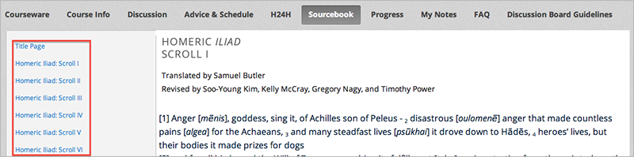

.. _Añadir Libros de Estudio:

###########################
Añadir Libros de Estudio
###########################

Se puede añadir libros de estudio en formato PDF para el curso.  

.. note::  No utilice los archivos de imagen (por ejemplo, archivos PNG) como los libros de estudio para el curso, ya que no son accesibles a los lectores de pantalla. 
           Revise el: ref: `Las mejores prácticas para PDFs` accesibles para más información.

Cada libro de texto que se agrega se muestra a los estudiantes como una pestaña en la barra de navegación del curso.

Es recomendable que se carguen los archivos PDF de los libros de estudio independientemente para cada capítulo del curso.

Cuando los estudiantes abren la pestaña en el curso, ellos pueden navegar por los libros de estudio de cada capítulo:

Añadir Libros de Estudio:

#. Desde el menú **Contenido**, seleccione **Libros de Estudio**.
#. Click **Nuevo libro de estudio**. Se abrirá una nueva pantalla:

  .. image:: ../Images/textbook_new.png
   :alt: Image of the New Textbook page.

3. Ingrese el **Nombre del Libro de Estudio**.
#. Ingrese el primer  **Nombre del Capítulo**.
#. Cargar el archivo ]PFD desde el computador, click **Cargar PDF**.  Sega las instrucciones para cargar el archivo.
#. Añadir más capítulos, click **+Añadir un Capítulo** y repetir el paso 3 y 4.
#. Click **Guardar**.
